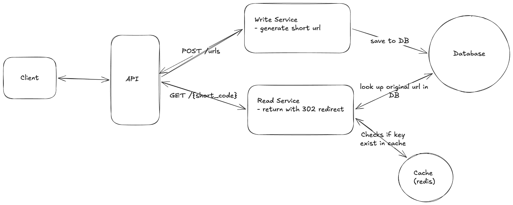
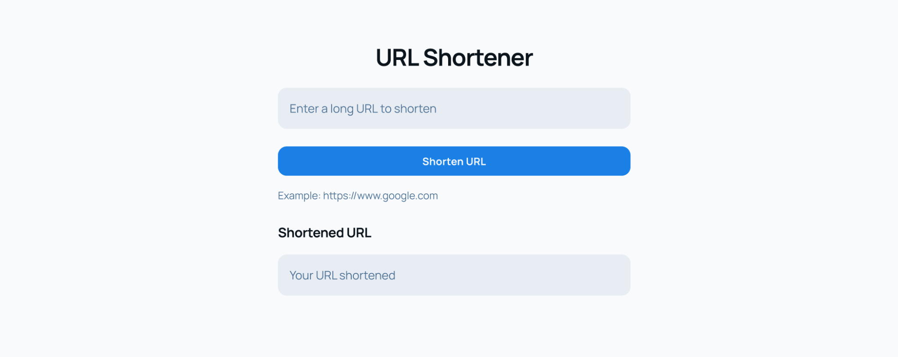

# URL Shortener - BSG

Technical specification for the community URL shortener backend (`bsg.wtf`). Source: [URL Shortener - BSG (Google Doc)](https://docs.google.com/document/d/1FrB76YTetbK-4J92J8zYcs77goptauixYoF-q9gXgOc/edit). When this README is finalized, the Google Doc will be updated to match it.

## 1. Project Summary

Build a service that creates short codes for long URLs and redirects `GET /{short_code}` to the original URL.

**Deadline:** 30th May, 2026

**Questions and resolved policy:**

1. Should users create accounts to generate short URLs? If no: anonymous `POST /urls`; If yes: auth, users table, link ownership
2. If two clients shorten the same long URL (including at the same time), what should happen? **Adopted:** at most one row per normalized `long_url`; a second create for the same normalized URL returns `409 Conflict` with the agreed error body.

## 2. Success criteria

By May 30, we succeeded if all of the following are true:

1. Short links work end-to-end. You can turn a long web address into a short link and opening that short link takes you to the original page; automated tests prove this keeps working.
2. Edge cases are handled predictably. Missing links, bad input, each give a clear, documented response, and tests cover those paths.

## 3. Functional requirements

1. **Shorten URL** — Client sends long URL; API returns a short URL
2. **Redirect** — Visiting `/{short_code}` resolves to the long URL via HTTP redirect.
3. **Validation** — Reject malformed long URLs (must be absolute `http` or `https` after parsing); apply **URL canonicalization** (below) before insert and before duplicate checks.

## 4. Non-functional requirements

1. **Uniqueness** — one `short_code` → exactly one mapping; one normalized `long_url` → at most one row
2. **Low-latency redirect** — design goal < ~100ms under normal load
3. **Availability** — prefer availability over strong cross-region consistency
4. **Read-heavy** — assume high read:write ratio

## 5. System Architecture

> **Note:** System Design is Subject to change



## 6. Core Components

1. **Client:** Any HTTP client; optional minimal web UI is a separate issue.
2. **Write service:** `POST /urls` — validate URL, allocate short code
3. **Read service:** `GET /{short_code}` — **Redis first**; on cache miss load from Postgres, then populate Redis (read-through).
4. **Redis:** Cache `short_code` → `long_url` with LRU eviction and a **1-day TTL** on cached keys (cache policy only; links are not time-limited in storage).
5. **Postgres:** Source of truth for mappings; surrogate primary key `id` (UUID); `short_code` UNIQUE NOT NULL; public redirect resolves **only** by `short_code`.

## 7. Database schema

**Table:** `url_mappings`

| Column | Type | Constraints / Notes |
| --- | --- | --- |
| `id` | UUID | PRIMARY KEY |
| `short_code` | VARCHAR(32) | NOT NULL, UNIQUE |
| `long_url` | TEXT | NOT NULL, UNIQUE; store the **canonical** form defined below |
| `created_at` | TIMESTAMPTZ | NOT NULL, default now() |

**URL canonicalization (for `UNIQUE(long_url)` and `409`):** Parse the input as a URL; require scheme `http` or `https`. Lowercase the scheme and the **ASCII host** (apply IDN/punycode for international domains). **Strip the fragment** for comparison and storage. For the path: remove a **trailing slash** unless the path is exactly `/`. Preserve **path and query** otherwise as emitted by the parser (query parameter order remains significant unless you adopt a stricter normalizer later). The value written to `long_url` and returned in APIs is this canonical string; `Location` on redirect uses the same stored value.

## 8. API contract

**Base URL:** `https://api.bsg.wtf/v1`

### 8.1 Create short URL

**Endpoint:** `POST /urls`

Request body (JSON):

```json
{
  "long_url": "string (required)"
}
```

**Response:** `201 Created`

```json
{
  "short_code": "abc123",
  "short_url": "https://bsg.wtf/abc123",
  "long_url": "https://..."
}
```

**Error responses**

| Code                      | When                                   |
| ------------------------- | -------------------------------------- |
| 400 Bad Request           | Invalid JSON, invalid URL              |
| 409 Conflict              | `long_url` already exists              |
| 422 Unprocessable Entity  | Optional: semantic validation failures |
| 500 Internal Server Error | Unexpected failures; log server-side   |

### 8.2 Redirect

**Endpoint:** `GET /{short_code}`

| Code                  | When                                 |
| --------------------- | ------------------------------------ |
| 301 Moved Permanently | Mapping exists; `Location:` long URL |
| 404 Not Found         | Unknown `short_code`                 |

## 9. Stack and Dependencies

- **Language:** Go
- **HTTP:** [chi](https://github.com/go-chi/chi) router; **logging:** `log/slog`
- **Postgres:** raw SQL via [`jackc/pgx/v5`](https://github.com/jackc/pgx) with `pgxpool`
- **Migrations:** [goose](https://github.com/pressly/goose)
- **Redis:** [`github.com/redis/go-redis/v9`](https://github.com/redis/go-redis)
- **Hosting:** serverless functions
- **Tests:** TBD

## 10. Tests

| Behavior | Assertion |
| --- | --- |
| Create minimal URL | `POST /urls` with valid `long_url` only → 201, JSON includes `short_code`, `short_url`, `long_url` |
| Redirect happy path | After create, `GET /{short_code}` → 301, `Location` equals stored `long_url` |
| Unknown code | `GET /{unknown}` → 404 |
| Duplicate long URL | Second `POST /urls` with same normalized `long_url` → 409 |
| Invalid long URL | `POST` with bad URL → 400 |

## 11. GitHub issue breakdown

Full engineer-facing descriptions, tasks, and PR success criteria for each row below live in [`docs/issue-descriptions.md`](docs/issue-descriptions.md).

**Reviewers:** Reviewer 1, Reviewer 2, Reviewer 3

| #   | Issue                                        |
| --- | -------------------------------------------- |
| 0   | Scaffold app layout and environment config   |
| 1   | Add database migrations with Goose           |
| 2   | Postgres persistence for short links         |
| 3   | Long URL validation and canonicalization     |
| 4   | Create-short-link HTTP handler               |
| 5   | Short code generation — research & implement |
| 6   | Short-link redirect handler                  |
| 7   | Redis read-through cache for redirects       |
| 8   | Liveness and readiness HTTP endpoints        |
| 9   | Milestone buffer: fixes and polish           |

**Weekly targets** (cumulative “done by” date):

| Week ending | Target issue #s | Outcome for that week |
| --- | --- | --- |
| May 10 | 0–5 | Runnable stack, goose migrations, persistence with duplicate-URL `409`, validation, `POST /urls` create flow, and short-code generation merged. |
| May 17 | 6–8 | `GET /{short_code}` with `301`, Redis read-through cache (LRU, 1-day TTL), and health endpoints merged. |
| May 24 | 9 | Bugfixes and any slip from earlier weeks |
| May 30 | — | UI and API integration, E2E test, as capacity allows |

## 12. UI Reference


